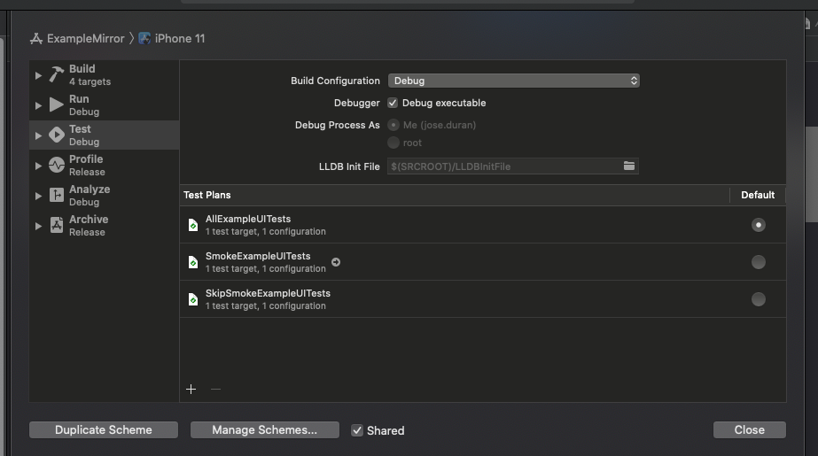
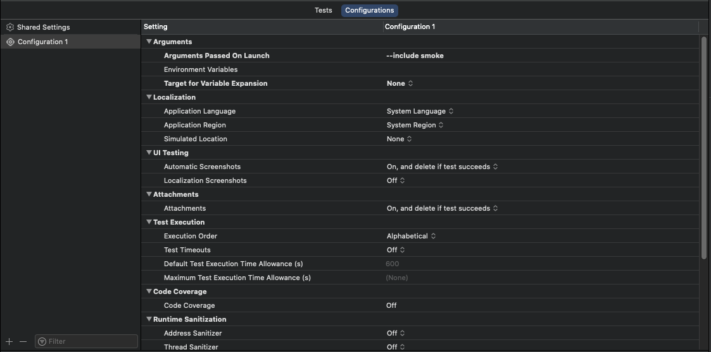

# UITestRunner

UITestRunner is the testing runner of this implementation. It will collect all .feature in the TestBundle and will ensure the execution of each scenario follows the backgrounds and step order defined on the .feature.

## How to use

Given the following .feature:

```gherkin
Feature: Bank Information
    As an customer
    I want to be able to add and update my bank information

    Background: I am on the Bank Information Screen
        Given I have logged in successfully
        And I am on the Bank Information Screen

    @smoke
    Scenario: Attempt to submit an invalid bank account
        Given I am viewing the Bank Information screen 
        When I input an invalid bank account
        Then I see an error indicating invalid bank account
```

The implemented test should look like this:

```swift

class BankInformation: FeatureXCTestCase {

    override func background(_ builder: ScenarioBuilder) {
        builder.given("I have logged in successfully") { XCTFail("TODO") }
        builder.and("I am on the Bank Information Screen") { XCTFail("TODO") }
    }

    func testAttemptToSubmitAnInvalidBankAccount() throws {
        try scenario {
            $0.given("I am viewing the Bank Information screen") { XCTFail("TODO") }
            $0.when("I input an invalid bank account") { XCTFail("TODO") }
            $0.then("I see an error indicating invalid bank account") { XCTFail("TODO") }
        }
    }
}

```

## Missing cases

The idea of this framework is to use the .feature files as the single source of truth of the tests. For that purpose it is necessary to be aware of adding, deleting or modifying .feature files in the project:

- Deleting or modifying .feature: We don't need to do anything, the associated test will fail because it is not finding the corresponding .feature.
- Adding .feature: We implement MissingScenariosXCTestCase. This will fail if it exists a .feature without a corresponding test.

```swift

class MissingScenarios: MissingScenariosXCTestCase {
    
    func testMissingScenarios() throws {
        try assertMissingScenarios()
    }
}

```

## Annotations 

In Gherkin it is possible to include annotations to create set of tests to execute or skip. This is specially useful to create a reduced set of critical tests, also known as smoke tests.

UITestRunner supports annotations on Feature and on Scenario preceded by @, but it is necessary to provide launch arguments to the TestBundle in order to recognize what to do with the processed annotations:

```Gherkin
@smoke
Feature: Bank Information
    As an customer
    I want to be able to add and update my bank information

    Background: I am on the Bank Information Screen
        Given I have logged in successfully
        And I am on the Bank Information Screen

    @smoke
    Scenario: Attempt to submit an invalid bank account
        Given I am viewing the Bank Information screen 
        When I input an invalid bank account
        Then I see an error indicating invalid bank account

```

# Arguments to TestBundle

UITestRunner accepts the following arguments in order to determine which scenario will be included in the tests. 
Excluded tests will be skipped using `XCTSkipIf` and, therefore, they will be marked in Xcode as skipped.

- To include all the tests marked with @smoke and @version1 `--include smoke version1`
- To skip all the tests marked with @version1 `--skip version1`
- To include all the tests marked with @smoke and skip @version1 `--include smoke --skip version1`

Priority of arguments:

- If not --include or --skip are defined, everything is included.
- An Scenario is skipped if it or its Feature are marked with skipped annotation.
- An Scenario is included if it or its Feature are marked with included annotation, and none of them are marked with skipped annotation.


One way to pass arguments to TestBundle is using TestPlans. It is possible to configure TestBundle Scheme with TestPlans and configure
arguments like this:



And then, on the configuration of each TestPlan it is possible to pass different launch arguments:



Then execute from local or CI the intended Test Plan.
